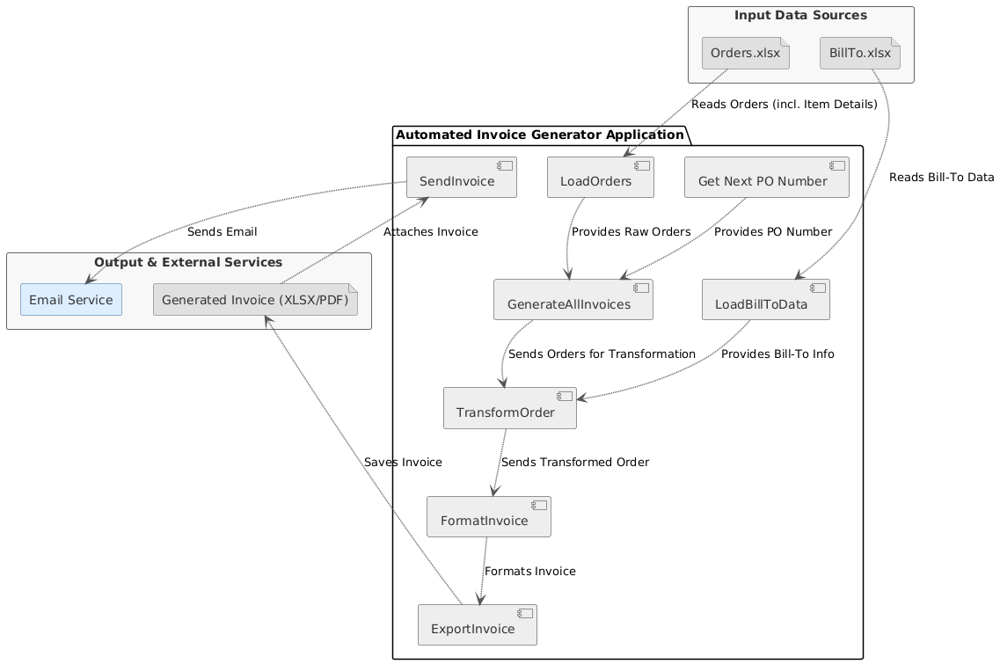

# Automated Invoice Generator

A Python-based tool for automating the generation, export, and delivery of professional invoices from Excel order data.

## Quick Start

### Local Installation
```bash
# Clone and install
git clone https://github.com/yourusername/automated-invoice-generator.git
cd automated-invoice-generator
pip install -r requirements.txt

# Generate invoices
python sample_invoice.py
```

### Docker Installation
```bash
# Clone the repository
git clone https://github.com/yourusername/automated-invoice-generator.git
cd automated-invoice-generator

# Build and verify the Docker container
./verify_docker.sh
```

For detailed Docker setup and troubleshooting, see [Docker Support](Docker_README.md).

## Key Features

- 📊 Excel-based order processing
- 📝 Professional invoice formatting
- 📤 Multiple export formats (XLSX/PDF)
- 📧 Automated email delivery
- 🧮 Automatic tax calculations
- 🔄 PO number management
- ✅ Comprehensive test coverage
- 🐳 Cross-platform Docker support (Windows/Linux)

## Documentation

For detailed documentation, including:
- Complete installation guide
- Usage examples
- Input data format
- Docker support
- Contributing guidelines

Please see the [full documentation](docs/README.md).

## Requirements

### Local Installation
- Python 3.7+
- Windows OS (for PDF generation using Excel)
- Microsoft Excel (for PDF generation)

### Docker Installation
- Docker
- For PDF generation:
  - Windows: Microsoft Excel (via win32com)
  - Linux: LibreOffice (automatically installed in container)

## Docker Support

The application is containerized and supports both Windows and Linux environments. For detailed Docker documentation, see [Docker Support](Docker_README.md).

### Quick Docker Commands
```bash
# Build the container
docker build -t invoice-generator .

# Run a sample invoice generation
docker run --rm -v ${PWD}/screenshots:/app/screenshots invoice-generator python sample_invoice.py

# Run tests
docker run --rm invoice-generator python -m pytest tests/
```

## License

This project is licensed under the MIT License - see the [LICENSE](LICENSE) file for details.

## Features
- **LoadOrders**: Read `orders.xlsx` → list of dicts  
- **FormatInvoice**: Populate an invoice template with order data  
- **ExportInvoice**: Save invoices as `.xlsx` or `.pdf`  
- **SendInvoice**: Attach & send via Outlook  
- **GenerateAllInvoices**: One-click pipeline to process all orders  
- Fully covered by **pytest** tests under `tests/`

## Email Integration

The application includes Outlook email integration for sending invoices directly from the application. The email functionality is implemented in `invoice.py` and includes the following features:

- Direct integration with Microsoft Outlook
- Support for multiple recipients and CC recipients
- File attachment support
- Comprehensive error handling and logging
- Unit tests for all email functionality

### Example Usage

```python
from invoice import SendInvoice
import platform

# Assuming pdf_path and invoice_filename_base are already defined
# e.g., pdf_path = "screenshots/invoice_INV-20240320-0001.pdf"
# invoice_filename_base = "invoice_INV-20240320-0001"

if platform.system() == "Windows":
    try:
        SendInvoice(
            emailAddr="recipient@example.com",
            filePath=pdf_path,
            cc="accounting@example.com", # Optional CC recipient
            additional_attachments=[f"screenshots/{invoice_filename_base}.xlsx"] # Optional additional attachments
        )
        print("Sent invoice successfully!")
    except Exception as e:
        print(f"Failed to send invoice: {str(e)}")
else:
    print("Note: Email sending is only available on Windows systems")
```

### Requirements for Email Functionality
- Windows OS
- Microsoft Outlook installed
- pywin32 package (included in requirements.txt)

## Screenshots

### Sample Invoice Sent Through Email


### Sample Invoice Generation


## Application Architecture

Here's an overview of the application's components and their interactions:



## Getting Started

### Prerequisites
- Python 3.11+  
- pip  

### Installation
```bash
git clone https://github.com/jessherna/automated-invoice-generator.git
cd automated-invoice-generator
pip install -r requirements.txt
```
